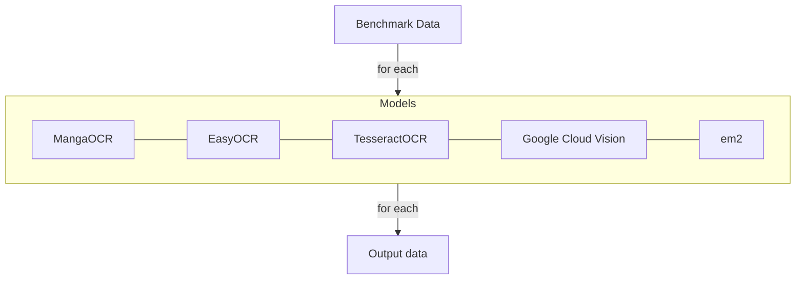

# OCR Evaluation

## Evaluation goal

Find the best OCR option for local OCR and potential external (API call) OCR.

## Planned benchmark

Manual evaluation with input vs expected output.

## Reports

### MangaOCR

Initial MangaOCR results on Pokémon-style Japanese game text show consistent partial recognition, but no exact matches across the first benchmark batch. Errors include kana substitution, punctuation hallucination, spacing collapse, and named-entity distortion. Current preprocessing does not consistently improve results. MangaOCR may still be useful as a human-assist OCR layer, but is not currently reliable enough for an automated pipeline.
