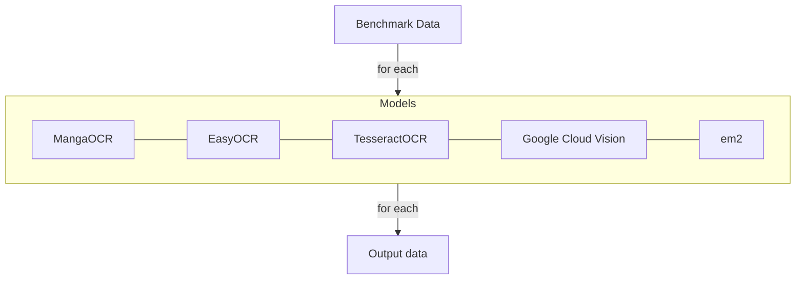

# OCR Evaluation

## Evaluation goal

Find the best OCR option for local OCR and potential external (API call) OCR.

## Planned benchmark



Manual evaluation with input vs expected output.

## Reports

### MangaOCR

Initial MangaOCR results on Pokémon-style Japanese game text show consistent partial recognition, but no exact matches across the first benchmark batch. Errors include kana substitution, punctuation hallucination, spacing collapse, and named-entity distortion. Current preprocessing does not consistently improve results. MangaOCR may still be useful as a human-assist OCR layer, but is not currently reliable enough for an automated pipeline.

### OCR.space

Initial OCR.space results on Pokémon-style Japanese game text show strong overall recognition quality, with no exact matches across the first benchmark batch but consistently high content accuracy. Errors primarily include spacing collapse, newline insertion, punctuation substitution (e.g. ! → /), and occasional minor kana or named-entity inaccuracies. Preprocessing provides mixed benefits, improving some cases while slightly degrading others. Despite the lack of exact matches, OCR.space outputs are generally close to the expected text and well-suited for human correction. With normalization and light post-processing, OCR.space appears viable as a core OCR backend, particularly in a human-in-the-loop workflow, though still not fully reliable for a purely automated pipeline.

### EasyOCR

Initial EasyOCR results on Pokémon-style Japanese game text show strong overall recognition quality, with no exact matches across the first benchmark batch but consistently high textual fidelity. Errors primarily include aggressive line splitting, punctuation or quote substitution, and occasional minor character mistakes. Unlike MangaOCR, EasyOCR preserves sentence content much more reliably, and its outputs are generally close to the expected text. Current preprocessing does not help and often slightly degrades results, suggesting raw screenshots are the better input path for this model. EasyOCR appears to be a strong local OCR candidate and is well-suited for a human-in-the-loop workflow, with promising potential for tokenization after light normalization, though it is still not fully reliable for a purely automated pipeline.

### Google Vision

Initial Google Vision results on Pokémon-style Japanese game text show the strongest overall recognition quality across the first benchmark batch, with no exact matches but consistently high textual accuracy. Errors primarily include spacing collapse, newline insertion, and minor punctuation normalization differences, while core sentence content is usually preserved correctly. In contrast to weaker OCR backends, Google Vision produces outputs that are often very close to the expected text and appear well-suited for light normalization and human review. Preprocessing provides meaningful improvements in some harder cases, suggesting it may be beneficial as an optional enhancement path. Google Vision appears to be the most promising external OCR backend tested so far and is a strong candidate for use in a human-in-the-loop workflow, with better potential than the other tested models for supporting tokenization after light post-processing, though it is still not fully reliable for a purely automated pipeline.

### Tesseract

Initial Tesseract results on Pokémon-style Japanese game text show moderate overall recognition quality, with no exact matches across the first benchmark batch but generally stronger performance than MangaOCR. Errors primarily include punctuation substitution (e.g. ! → /), newline insertion, and more concerning content-level character distortions, such as incorrect kana or occasional kanji substitutions within kana text. While Tesseract performs well on simpler textboxes and preserves sentence structure reasonably in some cases, it becomes less reliable on more complex inputs, where recognition accuracy degrades noticeably. Current preprocessing does not improve results and often significantly worsens output quality, indicating that raw screenshots are the preferable input for this model. Overall, Tesseract serves as a useful traditional OCR baseline but does not match the consistency or accuracy of EasyOCR, and is not strong enough to be selected as the primary local OCR backend for this project.

---

## Final Verdict

Based on the initial benchmark results across all tested OCR models, the following decisions are made for the project’s OCR strategy:

### Local OCR Backend: EasyOCR

EasyOCR is selected as the **primary local OCR solution**.

* It provides consistently strong recognition quality across Pokémon-style Japanese game text.
* It significantly outperforms MangaOCR and Tesseract in preserving overall sentence content.
* Its outputs are well-suited for **human-in-the-loop correction**, which aligns with the project’s design philosophy.
* It requires no external system-level installation (unlike Tesseract), making it more user-friendly for distribution.
* Preprocessing is not required and may even degrade results, simplifying the pipeline.

While not perfectly accurate, EasyOCR strikes the best balance between:

* setup simplicity,
* performance,
* and output usability for downstream tokenization.

---

### External OCR Backend: Google Vision

Google Vision is selected as the **primary external OCR backend**.

* It delivers the **highest overall recognition accuracy** among all tested models.
* It consistently preserves core sentence content with minimal character-level distortion.
* Its outputs are closest to expected text and require only light normalization.
* It performs well even on more complex or lower-quality inputs where local models struggle.

Google Vision is therefore the best candidate for:

* high-accuracy OCR use cases,
* more demanding inputs,
* and future “premium” or optional cloud-enhanced workflows.

---

### Fallback External OCR: OCR.space (Planned)

OCR.space is designated as a **planned fallback external OCR option**.

* It demonstrates strong and reliable performance, second only to Google Vision among external solutions.
* It provides a viable alternative in cases where:

  * Google Vision is unavailable,
  * API limits are reached,
  * or a lower-cost/free-tier option is preferred.

Future implementation may include:

* automatic fallback logic,
* user-selectable OCR providers,
* or tiered OCR strategies (local → fallback → premium).

---

### Summary

The resulting OCR strategy is:

```text
Primary (Local):     EasyOCR
Primary (External):  Google Vision
Fallback (External): OCR.space (planned)
```

This setup provides:

* a strong **offline-first experience**,
* a high-quality **optional cloud upgrade path**,
* and a flexible foundation for future improvements.
