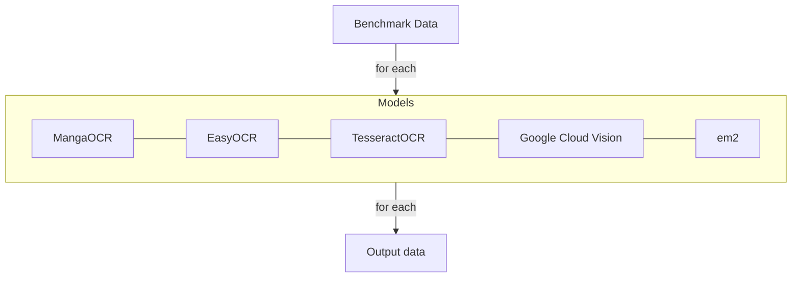

# OCR Evaluation

## Evaluation goal

Find the best OCR option for local OCR and potential external (API call) OCR.

## Planned benchmark

Manual evaluation with input vs expected output.

## Reports
